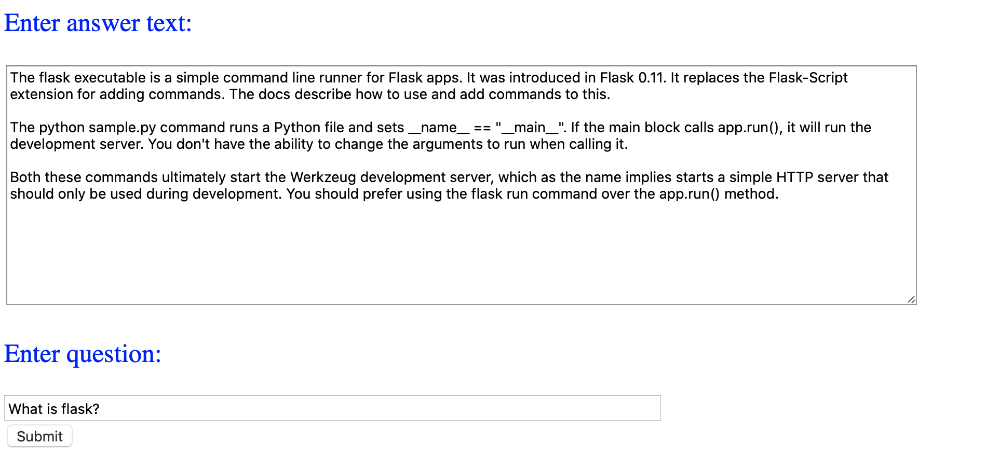
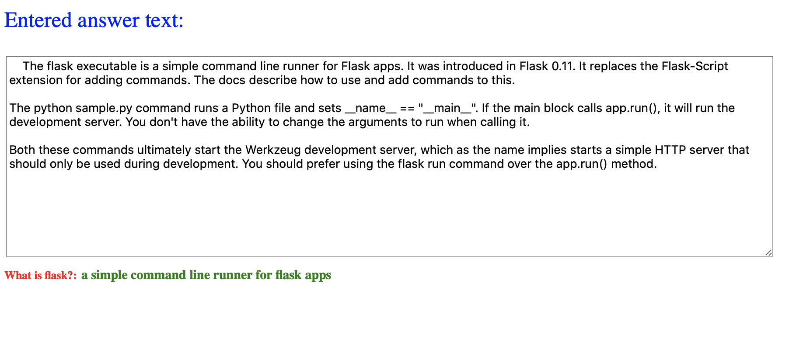

This project implements a WebApp which takes a passage and a question
(about the passage) as inputs and gives you the answer. In order to
find the correct answer, this application calls a web endpoint to a
BERT model that was deployed using AzureML. Check this repository
for more details: https://github.com/prabhat00155/onnx-odsc-east.

Here is a description of the project files:

template/home.html: Home webpage with input forms.
bert_q_and_a.py: This is the Python file which takes inputs from home.html,
parses them, calls the web endpoint passing these inputs and extracts the
results.
template/result.html: Result html page. 

In order to run these, we use Flask. First, let's install the requirements:

pip install -r requirements.txt

Then, we set the following enviroment variables: FLASK_APP to the python file bert_q_and_a and FLASK_ENV to production or development.
```
export FLASK_APP=bert_q_and_a
export FLASK_ENV=production
```
To use bert_q_and_a.py, update the code with your deployed model's URL.

Then, run the following:
```
flask run
```
This will give you a URL which can be used to access the WebApp.



